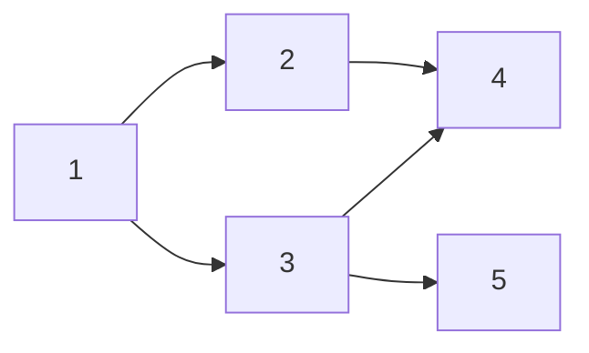

## 1. 배열 순회 - forEach

```js
a = [1, 3, 45, 2, 10]

a.forEach((element, index) => {
  console.log(element, index)
})

// 1 0
// 3 1
// 45 2
// 2 3
// 10 4
```

---

## 2. 문자열 분해 - split, join

```js
const str = 'Hello World'
const ret = str.split(' ')
console.log(ret) // [ 'Hello', 'World' ]
const a = ret.join(' 뭐시기 ')
console.log(a) // Hello 뭐시기 World
```

---

## 3. 정렬 - sort

```js
let numbers = [3, 1, 4, 1, 5, 9, 2, 6, 5, 3, 5]
numbers = numbers.sort((a, b) => a - b) // 오름차순
console.log(numbers) // [(1, 1, 2, 3, 3, 4, 5, 5, 5, 6, 9)]

numbers = numbers.sort((a, b) => (a - b) * -1) // 내림차순
console.log(numbers) // [(9, 6, 5, 5, 5, 4, 3, 3, 2, 1, 1)]
```

---

## 4. 필터링 - filter

```js
const numbers = [1, 2, 3, 4, 5, 6]
const ret = numbers.filter(ele => ele % 2 === 0)
console.log(ret) // [2, 4, 6]
```

---

## 5. 배열재가공 - map

```js
const numbers = [1, 2, 3, 4, 5]
const ret = numbers.map(el => el * 2)
console.log(ret) // [ 2, 4, 6, 8, 10 ]
```

```js
const numbers = [1, 2, 3, 4, 5]
let b = []
for (let a of numbers) {
  b.push(a * 2)
}
console.log(b) // [ 2, 4, 6, 8, 10 ]
```

---

## 6. reduce

```js
const numbers = [1, 2, 3, 4, 5]
const ret = numbers.reduce((total, element) => total + element, 0)
console.log(ret) // 15
```

---

## 7. 그외 기본문법

- Find, findIndex, includes, substing, slice, Object.keys, Object.values, Object.entries, Math.round, Math.ceil, Math.floor, Math.abs

---

## 8. DFS



- 탐색할 수 있는 방법 : 1 → 2 → 4 → 3 → 5
- 또는 : 1 → 3 → 5 → 2 → 4

```js
const graph = {
  1: [2, 3],
  2: [4],
  3: [4, 5],
  4: [],
  5: [],
}

const dfs = (here, visited = new Set()) => {
  if (visited.has(here)) return
  visited.add(here)
  console.log(here)
  graph[here].forEach(el => dfs(el, visited))
}

dfs(1)
// 1
// 2
// 4
// 3
// 5
```

---

## 9. 이분탐색 - 이진탐색

```js
const a = [1, 2, 3, 4, 5, 6, 7, 8]
const bs = () => {
  let lo = 0
  let hi = a.length - 1
  const target = 3

  while (lo <= hi) {
    let mid = Math.floor((lo + hi) / 2)
    if (a[mid] == target) {
      console.log(target)
      return '찾았다'
    } else if (a[mid] > target) {
      hi = mid + 1
    } else {
      first = mid + 1
    }
  }
  return -1
}

const ret = bs() // 3
console.log(ret)
```

---

## 10. 배열생성팁

```js
// 모든 원소가 0인 1차원배열
let a = Array(50).fill(0)
// console.log(a)

// 모든 원소가 1인 2차원배열
let b = Array(5)
  .fill()
  .map(el => Array(5).fill(1))
console.log(b)
```

---

## 11. DP - 피보나치

```js
const fibo = (idx, memo = {}) => {
  if (idx <= 2) return 1
  if (idx in memo) return memo[idx]
  memo[idx] = fibo(idx - 1, memo) + fibo(idx - 2, memo)
  return memo[idx]
}
const ret = fibo(10)
console.log(ret) // 55 => 1, 1, 2, 3, 5, 8, 13, 21, 34, 55
```

---

## 12. 스와핑

```js
const arr = [1, 2, 3, 4, 5]
;[arr[1], arr[3]] = [arr[3], arr[1]]
console.log(arr) // [ 1, 4, 3, 2, 5 ]
```
