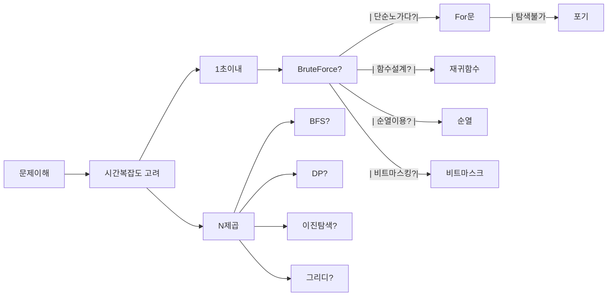

## 1. 기술 스택 - 코어

### 1.1 초봉

- 취업은 경쟁이기에, 남들과 같은 방법으로는 경쟁 우위에 설 수 없다.
- [블라인드 IT 업계 테크직군 초봉 엑셀리스트](https://docs.google.com/spreadsheets/d/1U28rQ6j0_byb1Tola_ZB8xsDsV1MlH1M66Sex6Qk3oM/edit#gid=0)
  - 신입한테 큰 연봉을 주지만, 한편으로는 이것으로 동기부여로 삼자.
  - 해야할 것 : IT 기업 리스트 중 내가 가고 싶은 후보 기업 선별 (기준 : 보상/복지/위치 등)
  - cf. 계약 초봉 : 기본 계약금
  - cf. 보너스 : PI(생산성 격려금), PS(회사가 잘되서 나오는 보너스)
  - cf. RSU : 주식을 양도해주는 것
- 생활, 자취비용 생각하기
  - 연봉 3000만원인 경우 - 세후 월 225만원 (2023년)
  - 연봉 4000만원인 경우 - 세후 월 294만원 (2023년)
  - 연봉 5000만원인 경우 - 세후 월 358만원 (2023년)
  - 연봉 6000만원인 경우 - 세후 월 421만원 (2023년)
  - 연봉 7000만원인 경우 - 세후 월 483만원 (2023년)
  - 연봉 10000만원인 경우 - 세후 월 643만원 (2023년)
- 빅사이즈/유니콘 기업을 목표하는 경우
  - 상대적으로 높은 시작 연봉, 이는 추후 이직/연봉 협상 인상률에 쭉 영향
  - 스타트업으로 이직이 쉬움
  - 높은 처우, 채용 허들 만큼 뛰어난 동료들과 업무를 진행
  - 스타트업 취업준비도 커버된다.
  - 한 번 허들을 넘으면, 유사 티어 기업으로 이직이 비교적 쉽다
- 스타트업을 목표로 하는 경우
  - 세상의 최적화에 실질적 기여로 자아실현을 매꾸려는 경우, 엑싯으로 더 큰 보상을 바라는 경우
  - 창업에 가까운 경험을 하고싶은 경우
  - 아직 전략으로 대기업을 가려는 경우
  - 대기업 요건(코테, 자격증(오픽 등))이 충분히 준비되지 않은 경우
- 구체적인 목표가 없다면?
  - 처우가 좋은 대기업을 목표(기술스택 공부 + 알고리즘 공부)
  - 취업이 급한 경우, 알고리즘 공부가 덜 된 경우 : 처우가 좋은 스타트업 목표
    - 알고리즘 능력보다는 기술 스택에만 우선 집중 (기술 스택 공부)
  - 직무에 따라서 개발을 안하는 곳도 있음(개발 외주 관리, 서버 및 시스템 구축)

---

### 1.2 프론트엔드 개발자가 하는 일

비즈니스적 관점

- 웹페이지의 표면 기술을 넘어, 어떤 비즈니스 가치를 지녔는가
- 마치 프론트엔드 개발은 `온라인 건물`을 건축하는 작업이다.
- 고객이 유입가능한 통로를 만드는 것
- 고객의 구매 단계까지 적절한 단계별 UI를 보여주는 것
- `문제 인지/해결` : 각 퍼널의 전환 비율은? 이를 개선시키기 위한 가설들은?
- 최적화된 프로세스로 UI/UX 반영에서 Backend Service까지 전달하는 것

기술 관점

- `퍼블리싱 기술` : 전반적인 퓁 화면, HTML 마크업, CSS 스타일링
- 재사용 가능한 UI 컴포넌트 만들기(React), 디자인 시스템 구축(Storybook)
- `서버 상태 관리` : 적시에 서버에서 데이터를 받아와서 적절하게 가공해서 보여줘야 한다.(Redux)
- `클라이언트 상태 관리` : 유저의 form 입력 관리, Validator 관리
- `단위 테스트 / 통합 테스트` : 추가된 기능으로 지금까지 쌓아온 코드들이 무너지면 안된다.
- `BFF (Backend For Frontend)` : UI에 필요한 데이터 형태에 맞게 전달해주는 서버
- `국제화 i18n` : 번역, 글로벌 서비스 지원
- `유저 이벤트 로깅` : 고객의 저널/퍼널 분석을 위해
- `시스템 배포 및 모니터링` : 서비스 지속적 배포 및 통합 / 모니터링 및 장애 알림

FE 입문 연습

- 바닐라 JS로 크롬 앱 만들기 - [Link](https://nomadcoders.co/javascript-for-beginners)
- React + GPT API로 AI 회고록 서비스 개발 - [Link](https://www.inflearn.com/course/react-gpt-api-ai%ED%9A%8C%EA%B3%A0%EB%A1%9D-%EC%84%9C%EB%B9%84%EC%8A%A4-%EA%B0%9C%EB%B0%9C)

---

### 1.3 채용 공고를 통해 기술스택 수집

3~4천만원 등록금을 내는 대학 수업으로 취업이 가능한가?

- 대학 수업과 취업에서 요구하는 기술은 **서로 다른 방향**을 보고 있다.
- 그나마 교집합이 컴공 6대 과목(자료구조, 알고리즘, 컴퓨터구조, 운영체제, 네트워크, 데이터베이스) CS이다.
- FE개발자로 취업하면서 CS 관련 지식을 물어보는 건 10%미만이다.
- 컴공 6대 과목 외 교양 수업을든 취업에 매우 간접적으로 도움이 된다.
- 결국, 전공자/비전공자 모두 **개발자 취업을 위해 따로 공부**해야 한다.

회사가 원하는 기술 파악(니즈 파악)

- 취업이 목표이므로, 기업공고를 통해 기술스택, 자격요건, 우대사항을 주기적으로 모니터링 및 수집한다.
- 기업에서 기술요구사항에 나의 기술스택을 맞춰가는 과정

기술 트렌드 파악

- FE 개발자 전체 로드맵을 확인해서 생태계를 이해한다. (더 일반적인 스택)
- 빠르게 변환하는 개발 생태계에서 트랜드를 파악하는 것이 중요하다.
- **우선순위가 높은 기술 먼저 공부**하는 것이 취업에 유리하다.
- 예를 들어, JQuery, AngularJS, JSP, PHP 등 기술이 교육과정에 포함되어 있다면, ‘**일반적 요구기술**’에서 벗어난다.

개발자 채용 공고방

- https://open.kakao.com/o/gCnjrrud

- 당근 Front
  - HTML / CSS / JavaScript, TypeScript
  - React Redux, Recoil
  - Full-stack Engineering (Node.js)
  - 우대사항 : NPM 패키지 출판 / ESM, CJS 모듈 이해
- 토스 Front
  - HTML / CSS / JavaScript, TypeScript
  - React / Redux, Recoil / React-Query
  - Emotion
  - NextJS
  - Yarn Berry, PNPM
  - Webpack, ESBuild, SWC, Babel
  - Full-stack Engineering (Node.js)
  - NPM 패키지 출판 / ESM, CJS 모듈 이해
  - 배포 자동화 경험
- 야놀자 Front
  - HTML / CSS / JavaScript, TypeScript
  - React / Redux, Recoil / React-Query
  - Emotion / Storybook
  - NextJS
  - Yarn Berry, PNPM
  - Webpack, ESBuild, SWC, Babel
  - Full-stack Engineering (Node.js)
  - NPM 패키지 출판 / ESM, CJS 모듈 이해
  - Unit Test, UI E2E Test
  - 배포 자동화 경험
- 네이버 Front
  - HTML / CSS / JavaScript, TypeScript
  - React / Redux, Recoil / React-Query
  - Emotion / Storybook
  - NextJS / GraphQL
  - Yarn Berry, PNPM
  - Webpack, ESBuild, SWC, Babel
  - Full-stack Engineering (Node.js)
  - NPM 패키지 출판 / ESM, CJS 모듈 이해
  - Unit Test, UI E2E Test
  - 배포 자동화 경험 / Docker / K8S

FE개발자 지원자격을 리스트업하면서 어떤 기술을 배워야 하는지 알 수 있다.

- 또한 최신 기술 트렌드를 스스로 찾아보고 판단할 수 있음
- `지원자격 부분` : 대부분 FE 개발자 교육과정을 들으면 커버된다.
- `우대사항 부분` : 따로 시간내어 공부하고, 프로젝트에 반영해야 한다.
  - 지원자격은 당연하고, 우대사항은 많이 알 수록 유리하다.
- 전반적인 FE기술 로드맵 : https://roadmap.sh/frontend
  - 배워야할 기술은 많지만, 로드맵 처음부터 하나씩 깊게 공부할 필요는 없다.
  - 강의/포트폴리오를 구현하다 그떄그떄 챙기자

---

### 1.4 기술 팁

- 모든 기업의 기술 스택을 맞출 순 없으니, 빈도가 높은 기술을 먼저 배우는 방향
- 동일한 목적의 기술들은 하나만 챙겨도 된다. (e.g. Redux vs Recoil vs Zustand), 하지만 장단점/특징 파악
- 기술별 키워드를 모를 수 있지만, 어떤 기술인지 조사는 해보자 (정의, 특징, 타기술 대비 장단점)
- 우대사항 요건을 한 줄 충족시키기 위해 생각보다 많은 공부를 해야할 수 있다 (e.g. Docker, K8S 유경험자)
- 그 기술 전반을 배우기에는 시간이 부족하다.
- (Crash Course와 같은 압축 강의를 듣고) 내 프로젝트에 필요한 내용만 적용시키는 전략 (DevOps 전문가 X, 사용자 O)

---

### 1.5 기술스택 커리큘럼 목표

1. 기업에서 요구하는 기술 스택을 최대한 배우고 연습한다.
   - Level 1은 적어도 퍼블리싱 업무가 가능하고, Level2는 리액트 프론트 개발까지 업무가 가능
   - 채용공고의 `자격요건은 90%`이상 배우는 것을 목표로
   - 채용공고의 `우대사항은 50%`이상 배우는 것을 목표로
2. 포트폴리오/팀프로젝트에 기반이 되는 기술을 배운다.
   - 강의/학원/기술 아티클 등을 통해서 기술을 배우고, 작은 과제나 미션들을 수행한다.
   - 비교적 작은 규모의 클론 코딩이나 과제로는 매력적인 포트폴리오가 어렵다.
   - 그래서 차별성있는 나만의 프로젝트에 배운 내용을 바탕으로 ‘기여하는’ 과정을 여러번 거친다.
   - 그 밑바탕이 되는 기술들을 배우는 것이 목표이다.
3. 추후 기술면접/포트폴리오 기반 면접에 질문의 밑거름이 된다.
   - 웹 프론트 기술을 배우고, 이를 포트폴리오에 적용시킨다.
   - 추후 면접에서 기술 자체에 대한 질문과 포트폴리오에 대한 질문을 하게 된다.

---

### 1.6 웹 FE 기술 레벨링

- Level 1 : 퍼블리싱 능력 기우기 (HTML / CSS / JavaScript / git / Netlify 배포)
  - `HTML / CSS` : 마크업으로 페이지 구조 잡기 및 스타일링
  - `JavaScript` : 기초적인 자바스크립트 지식
  - `git` : 버전관리
  - `Netlify 배포` : 가장 쉬운 배포방법
  - cf. https://www.udemy.com/course/100-2022-web-development/
- Level 2 : 웹 및 리액트 개발 능력 키우기 (React / Redux, Recoil, Zustand / React-Qeury / Styled-components )
  - `React` : 리액트 SPA(앵귤러 금지 / 처음배운다면 Vue보단 React / 심심하면 Svelte)
    - router, hooks, 차트, 필요한 부가적인 라이브러리
    - cf. https://www.udemy.com/course/best-react/?couponCode=KRLETSLEARNNOW
  - `Redux, Recoil, Zustand` : 클라이언트 상태관리 도구
  - `Fetch, Axios, React-Query` : 서버 상태 패칭 및 관리도구
  - `Styled-Components, Emotion` : CSS에 JS를 함께
- Level 3 : 서버지식을 겸비한 웹 개발 능력 기르기 (TypeScript, Next.js, Storybook, Unit Test, E2E Test, Webpack, Babel, Yarn Berry / Express, REST API, graphQL, RDB, ORM, Nest.js / CI, CD, AWS EC2, Docker)
  - `TypeScript` : 정적 타이핑
  - `Next.js` : Next가 제공하는 각종 기능 및 다양한 렌더링 방식들 (SSR, SSG, CSR)
    - cf. https://www.udemy.com/course/nextjs-react-incl-two-paths/?couponCode=KRLETSLEARNNOW
    - cf. https://www.udemy.com/course/react-for-senior-engineers/?couponCode=KRLETSLEARNNOW
  - `Storybook, Unit Test, E2E Test` : 테스트 및 자동화
    - cf. https://www.udemy.com/course/nextjs-testing/?couponCode=KRLETSLEARNNOW
  - `Webpack, Babel, Yarn Berry` : 프론트 개발환경 구축
    - cf. https://www.udemy.com/course/webpack-from-beginner-to-advanced/
  - `Express, REST API, graphQL` : API 만들어보기
    - cf. https://www.udemy.com/course/nodejs-mvc-rest-apis-graphql-deno/
  - `RDB` : SQL 구문
  - `ORM` : TypeORM, Prisma, sequelize
  - `Nest.js` : 노드 백엔드 프레임워크
  - `CI, CD` : GitHub action, Circle CI, Jenkins 등으로 빌드 및 배포해보기
    - cf. https://www.udemy.com/course/best-devops-docker-jenkins-cicd/
  - `AWS` : EC2, RDB, LB, Route53 등 클라우드 이해 (배포)
    - cf. https://www.udemy.com/course/aws-aws-xaws-for-beginners-cloud-practitioner-korean/
  - `Docker` : 도커 파일 만들어보기
    - cf. https://www.udemy.com/course/docker-kubernetes-2022/
    - cf. https://www.udemy.com/course/webpack-from-beginner-to-advanced/
  - `K8s` : 기업의 배포환경 이해(devops 전문 엔지니어급 공부x, 시간이 부족하다면 낮은 순위)

---

### 1.7 팁

- 반드시 강의를 통해 기술을 배울 필요는 없다.
- 역량이 된다면 공식문서를 보는 습관이 좋다.
  - 개발 자료의 양 : 공식문서 > 아티클 > 강의 (공식문서는 내용의 깊이도 깊지만, 불천절하거나 배경지식이 필요)
  - 개발 자료의 질 : 공식문서 < 아티클< 강의 (강의는 팔려는 목적이므로, 이해하기 쉽게 만들어야 한다.)
- 유데미 강의로 커리큘럼을 만들었지만, 인프런, 패스트캠퍼스, 노마드코더, 드림코딩 등 찾아보는 것이 좋다.
  - 특히, 한국어 강의고, 가성비 좋은 국내 강의도 많다.
- 공식문서, 기술 아티클 등으로 기술을 배우는 게 돈과 시간이 절약된다.
  - 알아야 할 지식이 많거나, 이해하기 어렵다면 강의의 도움을 받는 것이 효율적이다.
- 강의 선택 팁
  - github에 소스코드가 잘 정리되었는지 확인. **직접 강의를 보며 코드를 따라치는 것은 시간 낭비, 집중력 낭비**
  - 강의 완성본 코드 외에도, 강의 섹션 별 branch 혹은 commit log가 있으면 큰 도움이 된다.
  - 메인 강의에서 부족한 부분은 스스로 채워야 한다.
  - 배운 내용을 바탕으로 문서(블로그)를 작성하면 좋다. 나중에 강의를 다시 안보고 빠르게 배운 내용을 검색하는 용도
  - 클로코딩의 경우 그 프로젝트 그대로 포폴에 사용하면 안된다.
- 강의를 듣고, 3가지 위주로 정리 및 산출물이 나와야 한다.
  - 기술 컨셉(왜 쓰는지, 특징, 장단점)
  - 기술 코드 스니펫(내 프로젝트에 적용시킬 코드 조각들, 설치법, 기본 사용법 등등)
  - 비즈니스 로직 코드(연습용 예제 및 포트폴리오 레포)

---

## 2. 알고리즘 - 코어

### 2.1 알고리즘을 공부해야 하는 이유

**알고리즘 공부는 어렵고 실력 향상에 시간이 걸지지만, 피해갈 수 없다.**

- 개발자 채용시장에서 지원자를 1차 필터링하기 위해 사용한다. (공채 / 수시채용 / 인턴 / 대외활동)
- 즉, 아무리 개발 공부를 열심히 해도, 코테에서 떨어지면 인터뷰 기회조차 없다.
- 특징 기업/스타트업 채용 과정에서, 알고리즘 코테가 없는 경우도 있다.
- 코테를 준비를 안했을 떄, 지우너간으한 폭이 절반 이상 줄어든다. (특히, 네카라쿠배 등의 대기업은 준비 필수)
- 정식 개발자가 되기전 스펙활동(인턴, 대외활동)을 위해서도 알고리즘 공부가 필요하다.
- 인턴이나 장학금을 주는 대외활동은 인기가 많고, 열심히 하는 실력자들도 많다.
- 나의 평균은 주변 사람들의 평균이다. 열심히 하는 환경에 몸을 반드시 던지자.
- 한번 알고리즘을 공부해두면, 잘 까먹지 않는다.

---

### 2.2 알고리즘 실력 목표

- 어느 정도로 실력을 쌓아야 하는가?
- 다른 지원자들보다 높은 점수를 받아서, 코테 단계에서 N배수 선발 안에 들어가면 된다. (상대적)
- 백준 티어 기준 **플래티넘5 목표**로 공부하는 것을 추천(절대적)
- 기출 문제의 한 단계 어려운 수준 혹은 **어려운 골드 문제를 빠르고 정확하게 풀어내는 능력**이 중요

---

### 2.3 코테 언어 선택

- 처음 배운다면 Python을 추천
- 이유 : 베스트셀러 강의에서 보통 다루는 언어 / 오답노트시 Python 풀이 많음 / 배운느데 적은시간 / 배워두면 유용
- 보조언어로 JavaScript(FE), Java(BE) 선택, 동일 로직을 다른 언어로 컨버팅하는 건 어렵지 않음
- 프론트엔드 포지션 코테 중에는 JavaScript를 강제하는 경우가 종종 있다.
- 코테언어 3대장 : C++, Python, Java

---

### 2.4 구체적인 공부법

1. 인터넷 강의를 듣는 단계
   - 빠르게 학습하기 위해 처음에는 강의를 듣는 것을 추천
   - 어느정도 지식이 쌓이면, 필요한 내용만 강의를 듣고, 구글링 하며, 혼자 공부하는 비중이 늘어난다.
2. 배우는 것
   - 알고리즘을 풀기 위한 최소한의 문법(입출력, 컬렉션, 문자열, 정렬, 정규식)
   - 기본 자료구조(연결리스트, 스택, 큐, 트리, 힙, 그래프)
   - 코테 기출 유형에 해당하는 대표 알고리즘 및 접근법
3. 코테 기출 유형에 해당하는 알고리즘 및 접근법
   - Step1) 구현(시뮬레이션), 문자열 처리(파싱), Graph(BFS, DFS), BruteForce(재귀), DP, 정렬
   - Step2) 탐색(이진, 투포인터, 슬라이딩), 그리디, Graph(Union-Find, MST, 크루스칼, 다익스트라, 플로이드 와샬)
   - Step3) 트리(세그먼트, 트라이) - 취업용 코테를 벗어나기 시작한 대회문제
   - Step2 범위까지 공부해도 충분(과연 더 많은 지식을 몰라서 내가 틀리는지 고민)

강의

- 인프런 파이썬 알고리즘 문제풀이(코딩테스트 대비)
- Codeplus 코딩테스트 준비 - 문제, 연습

---

### 2.5 공부 팁

문제 정의

- 문제를 아예 손도 못댄다. (DeepDive / 개념, 응용 유형 학습)
- 문제를 많이 풀었으나 실전에서 적용하기 어렵다 (KnowledgeTree)
- 풀었던 문제를 ‘까먹고’ 못푼다 (Review Queue)
- 알고리즘 공부가 너무 하기 싫다 (심리)

메타인지적 문제 해결

- 알고리즘을 공부에도 시간투자를 많이 하므로, 효율성을 위해 공부방법에 대해서 논의가 필요하다.
- 스터디 혹은 인강에서는 그냥 풀이법(지식)을 배우고 끝내기보단, 한 단계 아래의 본질에 대해 알아야 한다.
- 개인적으로 수능 수학과 비슷한 접근법으로 생각한다.
- 메타인지적 사고는 다양한 문제해결에 도움이 된다.
- **같은 문제를 굳이 여러번 푸는 이유가 있다**.

---

### 2.6 알고리즘 근육

#### 2.6.1 Deep Dive

- 나는 틀린 문제를 정말 이해한 것인가? 아니면 풀이법을 받아들이고 외운건가?
  풀이논리에 대해 비약은 없는가? 풀이로직을 이해했다면 다시 설명할 수 있는가?
- 문제를 풀었던, 못 풀었던 깊은 고민을 하자.
- 처음보는 알고리즘인가? 시간복잡도를 고려안했는가? 예외케이스를 왜 발견못했는가? 유사한 문제는 없는가?
- 다시 이 문제를 보면 풀 수 있는가? 정답의 모든 코드들을 이해했는가? 어떻게 하면 풀이법을 떠올릴 수 있는가?
- 이렇게 계속 고민하고, 뇌를 뜨겁게 달구고, 기존 지식과 연결하려 노력하는 것이 DeepDive이다.
- **뇌의 혈류량을 증가하며, 뉴런 시냅스가 연결되며, 생각하는 깊이가 증가하며, 자주 생각해서 속도가 빨라진다**. (근육의 영역)

#### 2.6.2 KnowledgeTree

- 실전 문제와 내가 풀었던 문제의 유사성이 있는가? / 풀이법에 대한 의사결정트리가 있는가?
- DeepDive 과정으로 여러 Why에 대한 대답을 구했을 것이다. 그 중에서 풀이 접근법에 대한 정리가 필요하다.
- 새로운 문제는 어떤한 문제 유형인지 알 수 없지만, 내 머릿속 회로를 통해 최대한 유사한 풀이법을 기억해낼 수 있다.
- 문제를 보자마자 풀 수 있다. 반대로 문제를 읽고 풀이법이 떠오르지 않는다면 1분 정도 고민 후 포기 (풀수없음 - 메타인지)
- **유형별 정리 노트 사용**

- `그래프의 자료구조` : 인접행렬 | 인접리스트 | 간선리스트
  - 인접행렬 : `V ** 2` (플러드 필 같은 경우도 이에 해당)
  - 인접리스트 : `V+E` (V - 정점 수, E - 간선 수)
- `그래프의 탐색` : DFS | BFS

---

#### 2.6.3 Deep Dive & KnowledgeTree

1. `연결요소 개념` : 잘린 파편 그래프 조각을 연결요소, 컴포넌트라고 한다.
   - BFS | DFS를 N번 돌려서 컴포넌트 수 N개를 구할 수 있음
2. `이분 그래프` : A, B 두 그룹으로 노드를 나눔, 그룹 안에 간선은 존재하지 않음
   - 탐색을 통해, check값을 1, 2로 번갈아 주면서 나눌 수 있음
3. `싸이클 찾기` : 순열, 반복 수열 등으로 문제를 wrap함
   - 1차수의 그래프를 보고 1차원 graph를 만든 다음, 컴포넌트를 파악하는 문제
4. `플러드 필` : graph가 배열 형태의 구조(인접행렬 아님)
   - 1-갈 수 있는지 check, 2-범위 check, 3-방문여부 check 최소 3단계

ABCDE : https://www.acmicpc.net/problem/13023

- 특이점 : DFS 문제, 깊이가 최대 5이상 가능한지 파악하는 문제
- DFS를 돌리는데 있어, BF 백트래킹을 사용해야 한다.

미친 로봇 : https://www.acmicpc.net/problem/1405

- 특이점 : DFS 재귀로 탐색, check후 탐색 > 종료 후 check 해체 해야함!
- 예외처리 : 재귀함수의 basecase의 순서가 있다. 먼저 실패여부를 따져야 함. 그리고 성공 계산
- 특이점 : 화귤 기반 재귀함수가 발상이 어려웠음. 확률공간에 대한 이해가 필요

거리두기 확인하기 : https://school.programmers.co.kr/learn/courses/30/lessons/81302

- 특이점 : BFS로 탐색해야, 맨해튼 거리를 측정할 수 있음
- Graph가 P인 경우일 떄마다, BFS를 진행해서, 거리가 2 가능동안 P가 있는지 보면 된다.

불! : https://www.acmicpc.net/problem/4179

- 특이점 : 탈출과 유사한 문제, check배열의 초기값을 0, -1로 하면 안되는 경우
- 예외처리 : check 배열을 -1로 초기화하면 안된다. 애초에 불바다로 시작하는 것
- 각 컴포넌트에서 check를 늘리고 난 다음에 전수조사

화산쇄설류 : https://www.acmicpc.net/problem/16569

- 특이점 : BFS 큐를 우선순위 큐로 돌리고, 조건에 맞을때만 deque하며 탐색
- 예외처리 : 화산을 먼저 방문시켜두면, 먼저 폭발한 화산이 탐색을 다 못한다.

벽 부수고 이동하기 : https://www.acmicpc.net/problem/2206

- 특이점 : 최단거리 구하기, 이동 가중치는 벽을 부시나 안부시나 1로 동일
- 벽은 한 번만 부술 수 있다. → 다른 노드로 전이
- 3차원 check 배열 = `[x][y]` 벽을 부셨는가 여부 0 or 1를 기록한다.
- 비교 : 벽 부수고 이동 vs 알고스팟 잘 비교하기

벽을 부수고 이동하기2 : https://www.acmicpc.net/problem/14442

- 특이점 : 벽 부수고 이동하기와 동일, 하지만 K번까지 노드가 확장된다.

말이 되고픈 원숭이 : https://www.acmicpc.net/problem/1600

- 특이점 : 벽 부수고 이동하기와 동일, 하지만 K번까지 노드가 확장된다.

숨바꼭질5 : https://www.acmicpc.net/problem/17071

- 특이점 : 방문한 시간이 홀수인지 짝수인지에 따라 dist 배열을 나눠야 한다.

> 즉, 홀수 시간으로 최소방문거리, 짝수 시간으로 최소방문거리 각각 구한다.
> 예외 : 먼저 온 최소방문거리를 기록하며 짝수, 홀수가 섞이게 되고, 비록 홀수가 좀 늦더라고 홀수일 경우의 최소방문거리는 씹히게 된다.
> 이모티콘 문제 : (s, c)이치원 배열로, (n, 0-n)까지의 노드를 모두 bfs탐색을 통해 가봐야 함 - 사실 제일 먼저 도달하는 녀석을 구하면 됨

텔레포트 정거장 : https://www.acmicpc.net/problem/18232

- 특이점 : 리스트 큐 - 시간초과, 덱 큐 - 시간 OK

A -> B : https://www.acmicpc.net/problem/16953

- 특이점 : 메모리 제한떄문에 q를 dick으로 사용

알파벳 : https://www.acmicpc.net/problem/1987

- 특이점 : 파이썬 시간초과 개복치마냥 나온다.

> DFS 대신 BFS로 돌릴 수 있는 이유가, check보다 까다로운 중복된 알파벳 금지가 있다.
> graph의 알파벳을 앞에 추가할 것 - 알파벳 존재 여부를 따질 떄, 앞에서 컷당하는게 훨 빠름

---

#### 2.6.4 복습 큐 만들기(Review Queue)

- `정확한 틀린 유형 분석` : 나는 이 문제를 왜 틀렸는가?
  - 새로운 알고리즘 개념 / 응용 유형 / 구현 능력 / 라이브러리 사용법 / 시간복잡도 고려
- `에빙하우스 망각곡선` : 강의/블로그를 통해 풀이법을 알았다. 다시 풀면 나는 몇 주 후에 못풀까?
  - 레벨링(Lv 1-6) Lv6 - 아예 건드리지 못한 문제 / Lv3 - 2주 뒤에 망각 / Lv1 - 입코딩

---

### 2.7 알고리즘 기업별 유형 분석

|                  회사                  | 알고리즘                                                            |
| :------------------------------------: | ------------------------------------------------------------------- |
|          네이버(2020 하반기)           | 구현, 시뮬레이션, BFS, DP, 완전탐색                                 |
|           삼성(2020 하반기)            | BFS, 시뮬레이션                                                     |
|           삼성(2020 상반기)            | BFS, 시뮬레이션                                                     |
|       카카오(2021 블라인드 1차)        | 투포인터, 완전탐색, DP, 트라이, 파싱, 최단경로, 이분탐색            |
|          카카오(2020 하반기)           | 구현, 문자열                                                        |
|         카카오(2020 블라인드)          | 문자열, 재귀, 탐색, 트라이, 구현, 완전탐색, BFS                     |
|       카카오(2020 카카오 인턴십)       | 구현, 완전탐색, 투포인터, BFS, DFS, 트리, 유니온파인드              |
|         카카오(2019 블라인드)          | 배열, 해싱, map, 정렬, 조합, DFS, 정렬, 시뮬레이션, 트리 순회, 구현 |
| 카카오(2019 카카오 개발자 겨울 인터십) | BFS, 세그먼트 트리, 완전탐색, 자료구조, 다익스트라                  |
|       카카오(2018 블라인드 3차)        | 구현, 정렬,문자열,트라이                                            |
|       카카오(2018 블라인드 1차)        | Bitwise, 문자열, 구현, 정렬, 시뮬레이션, 스케쥴링                   |
|           라인(2020 하반기)            | 구현, 문자열, 시뮬레이션, 덱                                        |
|           라인(2019 상반기)            | 구현, BFS, DFS, DP                                                  |
|            NHN(2020 하반기)            | 모노톤 스택, 그래프                                                 |
|           NHN(2019 1차 면접)           | 플러드 필                                                           |
|             NHN(2019 코테)             | 구현, 시뮬레이션                                                    |
|           NHN(2018 1차 면접)           | Trie, 비트마스킹                                                    |
|             NHN(2018 코테)             | 구현, 시뮬레이션                                                    |
|              모비스(2019)              | DFS, DP                                                             |
|           신한(2020 상반기)            | BFS, 시뮬레이션                                                     |
|           신한(2020 하반기)            | 유니온파인드, 문자열, 우선순위큐, 완전탐색, [SQL]                   |
|               쿠팡(2020)               | 정렬, 위상정렬, 트리DP, 해싱(Map)                                   |
|             현대 오토에버              | 문자열, DP, 순열조합                                                |
|                 SK C&C                 | Heap, 구현, 순열, BFS                                               |
|                  파수                  | 트리, 조합, 파싱, 구현                                              |

코딩테스트 Algorithm 분류

- 구현
- DFS
- BFS
- Two pointer
- Brute Force
- DP
- Tree DP
- 시뮬레이션
- Union Find
- String
- 자료구조 -> 우선순위 큐, 스택, 트리
- 순열조합
- Trie
- Flood fill
- Bit masking
- 위상정렬
- 이분탐색
- 최단거리
- 파싱
- Segment Tree

---

### 2.8 동기부여 환경 구성

- 플레3을 찍었다. 프로그래머스 레벨3을 풀었다 등등 다 맞는 말인데 그닥 와닿지 않는다.
- 그냥 같이 스터디하던 팀원이 시뮬레이션 골드 문제 뭐 2달 꾸준히 풀다가 갑자기 취뽀하는게 백배 와닿는다.
- 왜냐면 그들의 노력이 엄청 어렵고 특별한게 아니라는 걸 눈으로 직접 본다.
- 커피 마시며 머리 뜯으면서 오늘도 문제풀고 공부하는게 끝이다. 뒤처지는것 같고 욕나오고 잘 풀리지도 않는 이 상황이 가장 빠른 길이다.
- 그 믿음을 가질려면 주변 환경에서 직접 눈으로 보고 스스로 믿음을 가지는 수 밖에 없다.

그러면 어떻게?

- 알고리즘 스터디를 강력하게 추천한다 (외부환경 만들기)
- 나보다 티어가 한 단계 높은 사람을 목표로 공부, 그 사람을 재껴야 겠다 (경쟁심리 만들기)
- 무조건 18시에는 스타벅스를 가서 2시간 동안 공부를 한다 (시스템 만들기)

---

## 3. 대외활동

### 3.1 목적

- 실력이 검증된 사람이라는 점을 경험이라는 이력서 항목에 적기 위함(네임드 인턴 이력, SW 교육 이력, 포트폴리오 등)
- 사실상 한큐에 취업을 하는 것은 어렵다. 이를 위한 예행연습들이 대외활동
- 취업을 위해서 현업과 최대한 가까운 활동이면 좋다.
- 몇 년 동안의 취업 기간을 길기 떄문에, 성장할 수 밖에 없는 외부 환경을 마련해두는 것이 좋음
  - e.g. 인턴 경험, 4대보험+월급, 실력있는 동료/개발자 네트워크, 멋진 프로젝트, 멘토링, 기기지원, 월100 장학금
- 각종 혜택이 있으니 반드시 취업전에 받을 수 있는 자원은 모두 받자.

---

### 3.2 언제 대외활동을 준비하면 좋은가?

- 당장 준비하자. (졸업전 간으한 대외활동, 졸업 후 가능한 대외활동이 있다)
- 인기있는 대외활동을 우선순위로 준비하고, 합격 후 포기해도 좋으니 기회가 되면 싹 다 지원하자
- 앞에서 언급한 2가지 코드 (기술 스택, 알고리즘 코테)가 충분히 되어있다면 - 합격 가능성 ↑
- 준비가 덜 되어도 대외활동에 지원하자. 불합격하더라도 실력의 객관화가 이루저지는 좋은 기회다.

---

### 3.3 대외활동 우선순위

- 대외활동의 우선순위 - 사람들의 알만한 기업의 인턴, 자원이 많은 SW교육 프로그램, 동아리 활동 순이다.
- 네임드 기업의 인턴 경험 - 이미 기업의 채용 프로세스를 통과한 사람 / 상당수준의 월급 / 4대보험 이력
- 채용연계형 인턴이면 더욱 좋다 (부트캠프형 채용연계도 있다)
- 협상의 능력과 도전 정신이 필요하지만, 스타트업 근무를 파트타입으로 진행해도 좋다 (4대보험 이력 = 경력으로 어필)
- 혹은 프리랜서 활동(개발 아르바이트)도 좋은 기회 중 하나이다.
- 다음으로 지원이 많은 SW 교육프로그램이 있다.
  - 소프트웨어 마에스트로 추천 (월 100만원 지원금, 노트북 200만원, 국내 최대 멘토링, 뛰어난 실력을 가진 연수생)
  - 싸피(ssafy) 추천 (단, 졸업자, 월 100만원 지원금, 체계적인 SW 교육 과정)
  - 서울42 추천 (100만원의 지원금을 최대 24개월 동안 수령, 교육공간 환경 제공)

---

### 3.4 인턴/채용연계형 예시

- 우아한 테크 캠프 : https://career.programmers.co.kr/competitions/3353
- 스마일 게이트 스토브 캠프 : https://careers.smilegate.com/student/development-camp
- 카카오 채용연계형 인턴 : https://careers.kakao.com/error
- 네이버 채용연계형 Dev Internship : https://www.catch.co.kr/NCS/RecruitInfoDetails/273133
- 프로그래머스 인턴 : https://career.programmers.co.kr/competitions/3287/2023-summer-coding
- ICT 학점 연계 인턴쉽 : https://www.ictintern.or.kr/main.do

---

### 3.5 SW 교육 지원 프로그램

- SAFFY : https://www.ssafy.com/ksp/jsp/swp/swpMain.jsp
- 소프트웨어 마에스트로 : https://swmaestro.org/sw/main/main.do
- 우아한 테크 코스 : https://www.woowacourse.io/curriculum
- Boostcamp : https://boostcamp.connect.or.kr/
- 카카오 테크캠퍼스 : https://www.kakaotechcampus.com/user/index.do
- Apple 디펠로퍼 아카데미 : https://developeracademy.postech.ac.kr/
- 서울42 : https://42seoul.kr/seoul42/main/view
- 한이음 ICT : https://www.hanium.or.kr/portal/index.do

---

### 3.6 국비지원 부트캠프

- 리스트업 : 부트텐트 : https://boottent.sayun.studio/camps
- 구름톤 트레이닝 : 풀스택 개발자 양성 과정 : https://k-digital.goorm.io/b2g/kdt/fullstack
- 엘리스 트랙 : https://elice.training/track/sw
- 프로그래머스 k digital training : https://school.programmers.co.kr/learn/courses/17920/17920-5%EA%B8%B0-k-digital-training-%EB%B9%85%EB%8D%B0%EC%9D%B4%ED%84%B0-%ED%94%8C%EB%9E%AB%ED%8F%BC-%ED%94%84%EB%A1%A0%ED%8A%B8%EC%97%94%EB%93%9C-%EC%97%94%EC%A7%80%EB%8B%88%EC%96%B4%EB%A7%81

---

### 3.7 중앙 동아리

- SOPT : https://www.sopt.org/
- 디프만 : https://www.depromeet.com/
- Mash Up : https://mash-up.kr/
- 멋쟁이사자 : https://www.likelion.net/
- YAPP : https://www.yapp.co.kr/
- 프로그라피 : https://prography.org/
- DDD : https://dddstudy.medium.com/
- Nexters : https://teamnexters.com/

---

## 4. 포트폴리오

### 4.1 프트폴리오 정복 전략

- 문제 : 기업에서는 실무를 진행할 기술을 가진 개발자를 원한다.
  - 기업은 비즈니스 모델을 가지고 있다. 비즈니스를 굴리는 기술력이 있는 인재를 원한다.
  - 개인은 비즈니스 모델을 가지고 있지 않기 떄문에, 기술력을 바탕으로 회사에 취업한다.
- 즉, 기술적 차별성이 있는 사람(기술력, 성장성), 팀워크가 가능한 사람(커뮤니케이션), 프로덕트 관점(비즈니스 해결능력)
- 학원/강의에서 찍어낸 유사한 프로젝트들은 너무나 많다.
- 솔루션: 다른 경쟁자와 차별성을 가지는 팀(개인)프로젝트 포트폴리오가 있어야 한다.
- 기술적 차별성이 있는 사람(기술력, 성장성), 팀워크가 가능한 사람(커뮤니케이션), 프로덕트 관점(비즈니스 해결능력)
  - 가설: 위 메시지를 내포하고 있는 포트폴리오를 만들면 경쟁 우위에 있다.
  - 위 메시지를 구현할 몇 가지 기능들을 포폴에 녹여낸다.
  - 이는 차별성이 있는 포트폴리오로 취업에 보다 유리할 것이다.

---

### 4.2 목표

보통의 프로젝트보다 차별성있는 포폴을 만들 수 있는 3가지 전략을 소개

1. 기술적 차별성이 있는 사람(기술력, 성장성) : FE개발 구현능력은 물론 기술력 및 성장 가능성을 보여주는 사람
2. 팀워크가 가능한 사람(커뮤니케이션) : 문서화 및 개발 관리 프로세스를 잘 따르는 사람
3. 프로덕트 관점(비즈니스 해결능력) : 개발 뿐 아니라 Product에 관심이 있어 PM/PO과 협업 가능한 사람
   - 위 세부사항들을 포트폴리오 한줄 한줄 녹이면 된다.
   - 그 내용을 바탕으로 자조서를 작성하고, 면접 질문을 받게 된다.
   - 열심히 만들 결과물을 잘 정리하는 것이 중요하다
   - 보여줄 수 없거나, 제대로 말하지 않으면, 그것은 해도 한 것이 아니다.

---

### 4.3 포트폴리오 재료

포트폴리오 재료 : 차별성있는, 취업에 유리한 포폴을 만들기 위한 작은 기술, 테크닉들

1. 기술적 차별성이 있는 사람(기술력, 성장성) : FE개발 구현 능력은 물론 기술력 및 성장 가능성을 보여주는 사람
   - e.g.) 테스트 가능한 FE환경 구축 → 재료 : Unit Test + E2E Test + MSW + Storybook
2. 팀워크가 가능한 사람(팀워크, 커뮤니테이션) : 문서화 및 개발 관리 프로세스를 잘 따르는 사람
   - e.g.) 애자일 방법론 적용 → 재료 : 스프린트 + 백로그 + 회의 주도 + 스탠드업 미팅
3. 프로덕트 관점(비즈니스 해결능력) : 개발 뿐 아니라 Product에 관심이 있어서 PM/PO과 협업 가능한 사람
   - e.g.) 고객의 니즈 파악 → 재료: 설문조사 + 유저 활성화 로깅

---

### 4.4 기술력, 성장성을 위한 재료들

- `디자인 시스템` : Atomic Desing Pattern + BEM + 스토리북 + 공용라이브러리 개발
- `테스팅` : Unit Test + E2E Test + MSW(Mock Server, Service Worker)
- `최적화` : 브라우저 및 렌더링 최적화 경험 (React 테크닉, NextJS 테크닉, 성능 프로파일링, FCP, TTI 지표개선)
- `프론트개발 환경 구축` : Webpack, ESLint, Husky, Yarn Berry, Mono Repo
- `Interactive Web/2D/3D` : D3 + Canvas + interactive + ThreeJS
- `실시간성` : CRDT + WebRTC + sockerIO
- `백엔드` : 풀스택 공부, Server Side 아키텍처 공부, BFF 패턴 구현
- `마이크로 프론트엔드` : Micro Frontend
- `SSR` : 서버사이드 + 캐싱 전략 + CDN 배포 + 스케일링
- `CI/CD` : 구축 Jenkins, Circle CI, Github Actions
- `직접 배포 구축하기` : Nginx + Docker + Portainer
- `부하테스트 및 성능 개선` : artillery.io + System Design
- `모니터링 및 로깅 시스템` : Sentry + Grafana + Prometheus

> e.g. 확장가능한 + 안전성있는 마이크로 프론트엔드 웹 개발환경 구축 : MicroFE + E2E Testing

---

### 4.5 기술 상세

#### 4.5.1 테스팅 : Unit Test + E2E Test + MSW

목적 & 예상 성과 : 테스트 가능한 컴포넌트 구조 설계 능력, 테스트 자동화로 안정성있는 웹 개발

- `Unit Test` : 함수, 클래스 Level 화이트 박스 테스트 (도구 - Jest)
- `E2E Test` : Application, System Level 블랙 박스 테스트 (도구 - Cypress)
- `MSW` : Service Worker 기반의 API Mocker Server 구현 (외부 서비스(API)에 의존하지 않는 테스트 환경)

---

#### 4.5.2 성능 최적화 : 브라우저 및 렌더링 최적화 경험

목적 & 예상 성과 : 문제점 발견 → 가설 → 렌더링 최적화를 진행 → FCP, TTI x% 개선

- `React 최적화 테크닉` : Memorization(useMemo), Code Splitting, Virtualization, Lazy loading
- `NextJS 렌더링 최적화 테크닉` : CSR, SSR, ISR, Stream, SSG
- `성능 프로파일링` : 크롬 개발자 도구를 이용해서 병목, 성능을 확인할 수 있다. (LightHouse, Performance 탭)
- FCP, TTI 등 성능 지표 이해

---

#### 4.5.3 프론트 개발 환경 구축 : Webpack, ESLint, Husky, Yarn Berry, Mono Repo

목적 & 예상 성과 : 직접 프론트 개발 환경을 구축 및 관리 능력

- `Webpack` : 모듈 번들러, 번들링 및 최적화 작업
- `ESLint` : 정적 분석 도구, 팀이 일관된 코딩 스타일을 유지(커스텀 규칙 추가)
- `Husky` : 코드 푸시 전에 코드 포매팅 및 오류 검사
- `Yarn Berry` : PnP(Plug’n’ Play) 시스템, Zero-Installs → 빌드 속도를 향상
- `Mono Repo` : 코드의 공유성과 일관성을 유지(Lerna)

---

#### 4.5.4 인터렉티브 웹/2D/3D : D3 + Canvas + Interactive + ThreeJS

목적 & 예상 성과 : 인터렉티브 혹은 그래픽 관련 웹 결과물

- `Interactive Web` : CSS + JS
- `Canvas` : Canvas API (WebGL)
- `D3.js` : 인터렉티브한 데이터 시각화를 JavaScript 라이브러리
- `Three.js` : 웹에서 WebGL을 기반, 3D 모델, 애니메이션, 효과 등을 쉽게 구현

---

#### 4.5.5 실시간성 : CRDT + WebRTC + Socket IO

목적 & 예상 성과 : 웹상에서 실시간 편집, 영상, 채팅 등의 기능 구현

- `CRDT` : 구글 Docs처럼 동시문서편집 가능(yjs 라이브러리)
- `WebRTC` : 화상통화, 화상회의 구현
- `SocketIO` : 실시간 양방향 통신으로 채팅 구현(실시간 업데이트가 필요한 부분)

---

#### 4.5.6 백엔드 : 풀스택 공부, Server Side 아키텍처 공부, BFF 패턴 구현

목적 & 예상 성과 : 백엔드의 기술 스킬을 사용할 수 있는 FE 엔지니어

- `Backend Side 공부` : 기본적인 DB CRUD, REST API 구현
- `System Design 공부` : 어떻게 하면 대규모 트래픽을 처리할 수 있을지에 대한 고민(with Server Side Rendering)
- `BFF 패턴 구현` : Backend For Frontend, 프론트(View)를 위한 전용 API 서버 구현

---

#### 4.5.7 마이크로 프론트엔드

목적 & 예상 성과 : 다양한 도메인 팀이 협력할 수 있는 플랫폼 개발

- `Integration 전략` : 다양한 MicroApp 통합 전략 이해 및 적용 : https://martinfowler.com/articles/micro-frontends.html
- `Webpack Module Federation`
- `Scatter and Gather Pattern` : 빌드 타입 통합에서 사용할 수 있는 아키텍처 패턴

---

#### 4.5.8 SSR + 캐싱 전략 + CDN 배포 + 스케일링

목적 & 예상 성과 : 서버사이드 렌더링 기능 확장성과 성능을 겸비한 능력

- e.g. 수천, 수만명의 트래픽을 견딜 수 있는 이벤트 페이지
- `SSR` : 다양한 서버사이드 렌더링 전략 관리
- `캐싱 전략` : 응답, 생성된 정적페이지, 빌드 출력 및 이미지, 글꼴, 스크립트와 같은 기타 정적 자산을 캐시
- `CDN 배포` : 글로벌 서비스 및 트래픽 대응
- `스케일링` : 서버 자체를 늘리는 다양한 전략(k8s)

---

#### 4.5.9 직접 도커 운영 시스템 구축 : Nginx + Docker + Portainer

목적 & 예상 성과 : 도커 운영 환경 구축 능력

- `CI Tools` : NestJS App 빌드 → Docker Image 제작 → Docker Hub Push
- `Docker` : 웹 어플리케이션 이미지를 컨테이너로 구동
- `Portainer` : 배포 자동화 Web Admin Tool
- `Nginx` : 라우터(Reverse Proxy) (e.g. www.domain.com → Next web)

---

#### 4.5.10 모니터링 및 로깅 시스템 : Sentry + Grafana + Prometheus

목적 & 예상 성과 : 시스템을 모니터링 하고 메트릭을 수집할 수 있는 운영 능력을 가진 개발자

- `Sentry` : Browser App 로깅, 성능 지표 확인
- `Grafana` : Server Side 모니터링 시각화 대시보드
- `Prometheus` : 메트릭 시계열 DB

---

### 4.6 애자일 방법론 적용

스크럼 : Agile 방법론 중 하나, 주기적으로 작은 단위(Sprint)을 수행하여 목표를 달성

- `Sprint` : 이번 주 할일 목록
- `Product Backlog` : 해야할 목록
- `데일리 스탠드업 미팅` : 너 어제 뭐했냐?, 어려운거 있냐?
- `Pair Programming` : 한 명이 코딩을 하고, 다른 한명이 리뷰 및 조언을 제공하는 형태(혼자보단 둘이 낫다)
- `Kanban Board` : 작업 현황판
- `회의 주도` : 이러한 스크럼 시스템을 직접 해보자.

---

#### 4.6.1 OKR : 목표 주요 결과지표 관리

존 도어 (벤처 투자자)가 구글에 전해준 성공 방식 : OKR

- `목표(Object)` : 팀원(조직)들이 바라보고 있는 하나의 큰 목적
  - 팀원들 모두 이 목표를 보고 달려간다.
- `결과 지표(Key Result)` : 구체적인 성과 지표
  - e.g. 고객 100명을 내 서비스 안으로 유입시키기 (비즈니스 지표)
  - e.g. LightHouse Score 80 → 90점으로 올려 웹페이지 성능 개선하기(기술적 지표)
  - 정성적 지표도 괜찮다. (e.g. 리액트 배포하기, OO부분 유지보수하기)
- 취업을 위해서는 기술쪽에 초점을 맞추는 것이 필요하다.
  - 창업형에 초점을 맞추면, 비즈니스 로직이 방대해지고,
  - 기술형에 초점을 맞추면, 기술 스택, 기술적 도전이 늘어난다.

---

## 5. 과제테스트

- 실제 프로젝트/개발은 React, Next.js 환경에 진행, 그러나 과제 중 바닐라 JS를 이용한 웹 구현 과제가 존재한다.
- React 과제는 플젝 준비하면서 어느정도 대비된다. 하지만 바닐라 JS 및 클래스로 웹구현은 전혀 다른 세상이다.
- 과제테스트 유형 1 - `JS 바닐라형` : 프로그래머스 Dev Matching
  - [만들고 비교하며 학습하는 리액트 (React)](https://www.inflearn.com/course/%EB%A7%8C%EB%93%A4%EB%A9%B4%EC%84%9C-%ED%95%99%EC%8A%B5%ED%95%98%EB%8A%94-%EB%A6%AC%EC%95%A1%ED%8A%B8)
  - [React-router-dom 구현 등 여러가지 스킬 참고용](https://www.youtube.com/@dcode-software/videos)
  - [Build 15 JavaScript Project - Vanilla JavaScript Course](https://www.youtube.com/watch?v=3PHXvlpOkf4)
  - [프로그래머스 과제 테스트](https://school.programmers.co.kr/skill_check_assignments?page=1)
- 과제테스트 유형 2 - `React형` : 토스(React), 그 외 몇몇 수시채용
  - [해커랭크](https://www.hackerrank.com/skills-verification)
  - [퀴즈 - BFE.dev](https://bigfrontend.dev/)
  - [algochurn.com](https://www.algochurn.com/frontend)

---

## 6. 기술/포폴/인성 면접

- 이력서는 지금까지 준비한 모든 것들을 요약 정리한 1장짜리 문서다.
- 이력서를 본 면접관(HR 담당자)이 나를 뽑아야 할 이유를 판단
- 필살기 내용을 하이라이팅(e.g. 유수한 기업의 인턴, 누구나 알만한 대외활동, 노력이 보이는 구체적인 성과)
- 이력서는 피드백을 받아보는 것이 좋다 (제 3자가 이력서를 처음보고, 이 사람에 대해 잘 이해가 되는지 판단하기 위함)
- 이력서 템플릿 : https://fast-paradox-f5f.notion.site/Template-7ca85ffc87d1437a9e0d3ff2f30f22ff
  - 실제 이력서/포트폴리오는 Docs/PDF로 작성하기

---

## 7. 취업활동 사이클

1. IT 기업 취업 공고방 오픈챗에서 직무 포지션 줍줍
   - 채용공고 오픈방 : https://open.kakao.com/o/gCnjrrud
2. 자소서가 있다면(성과, 경험, 인사이트)을 위주로 어필(타사와 중복되는 항목은 복붙 - 나만의 DB만들기)
   - 자조서 쓰는 법 유튜브 : https://www.youtube.com/@leebro_interview
3. 코테가 있다면 기본문제로 풀기(e.g. BFS/DFS 기초문제)
4. 면접은 질문 기출 리스트가 있음. 미리 준비된 질문이 나오면 굳, 없다면 땀 뻘뻘 흘리면서 깔끔하게 모르겠다고 인정
5. 셀프 피드백
6. 1번부터 다시 반복
   - 취업 전형마다 요구 능력의 집합이 생각보다 많이 다르다
   - 그래서 최대한 많이 지원해야 한다.
